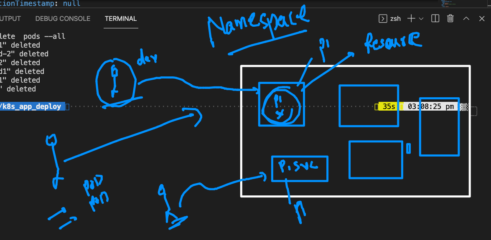
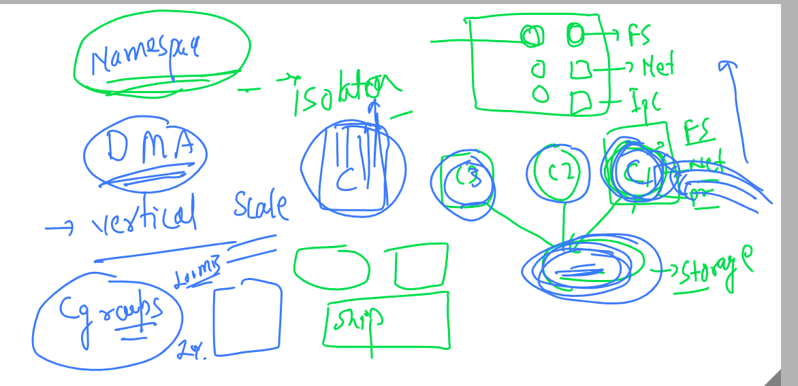

# Namespaces in Docker & containers



## Intro to Cgroups 



## 

```
172  docker  run -tid --name ashuc1  oraclelinux:8.4  ping fb.com 
  173  docker  ps
  174  docker  stats
  175  history 
  176  docker  exec  -itd  ashuc1  ping google.com 
  177  docker  stats
  178  docker  top  ashuc1
  
```

## LImit Ram 

```
 docker  run -itd --name ashuc2  --memory 100m alpine ping fb.com 
 
```

### limit ram and cpu 

```
docker  run -itd --name ashuc3 --cpu-shares=20   --memory 100m alpine ping fb.com
```

### restart policy 

[restart policy](https://docs.docker.com/config/containers/start-containers-automatically/)


## putting restart policy 

```
docker  run -itd --name myname --restart always alpine ping localhost

```

