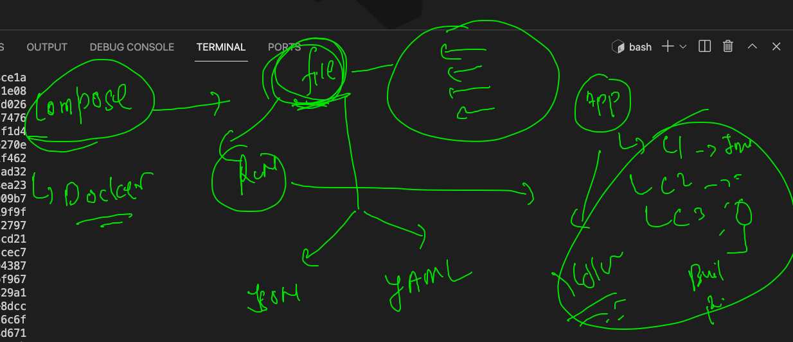
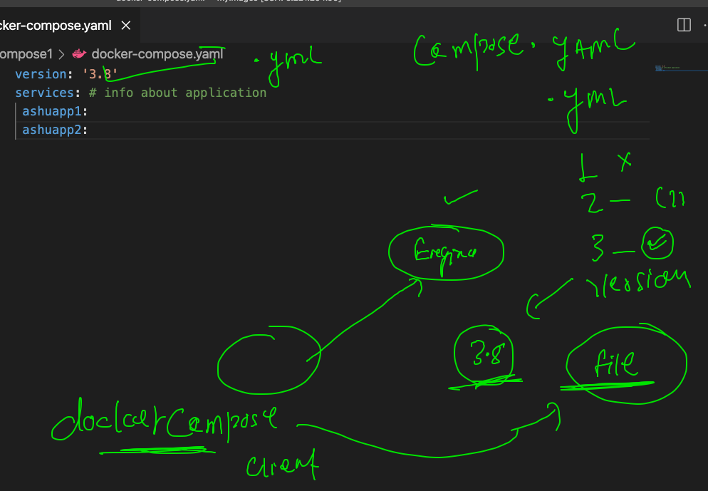

# Docker client options 


## web UI using portainer

```
docker run -d -p 8000:8000 -p 9000:9000 --name=portainer --restart=always -v /var/run/docker.sock:/var/run/docker.sock -v portainer_data:/data portainer/portainer-ce

```


### creating  multi app docker image and container 

```
384  docker  build -t  dockerashu/customer1:v1  . 
  385  cd  customer1/
  386  docker  build -t  dockerashu/customer1:v1  . 
  387  history 
  388  docker  images
  389  history 
  390  docker  run -itd --name ashucapp1  -e  myapp=app1  -p 2211:80  dockerashu/customer1:v1 
  391  docker  ps
  392  docker  run -itd --name ashucapp2  -e  myapp=app2 -p 2200:80  dockerashu/customer1:v1 
  393  docker  ps
  394  docker  run -itd --name ashucapp3  -e  myapp=app3 -p 2299:80  dockerashu/customer1:v1 
  395  docker  ps
  
  ```
  
  ## Storage in container 
  
  
  
  ### Containers are ephemral in nature 
  
 ```
 [ashu@ip-172-31-79-145 myimages]$ docker run -it --name c1  alpine  sh 
Unable to find image 'alpine:latest' locally
latest: Pulling from library/alpine
29291e31a76a: Pull complete 
Digest: sha256:eb3e4e175ba6d212ba1d6e04fc0782916c08e1c9d7b45892e9796141b1d379ae
Status: Downloaded newer image for alpine:latest
/ # 
/ # ls
bin    dev    etc    home   lib    media  mnt    opt    proc   root   run    sbin   srv    sys    tmp    usr    var
/ # mkdir helloo data 
/ # ls
bin     dev     helloo  lib     mnt     proc    run     srv     tmp     var
data    etc     home    media   opt     root    sbin    sys     usr
/ # exit
[ashu@ip-172-31-79-145 myimages]$ docker  rm c1
c1
[ashu@ip-172-31-79-145 myimages]$ docker run -it --name c1  alpine  sh 
/ # ls
bin    dev    etc    home   lib    media  mnt    opt    proc   root   run    sbin   srv    sys    tmp    usr    var
/ # exit

```

### creating volume 

```
[ashu@ip-172-31-79-145 myimages]$ docker  volume  create ashuvol1 
ashuvol1
[ashu@ip-172-31-79-145 myimages]$ docker volume  ls
DRIVER    VOLUME NAME
local     ashuvol1

```

### creating container with volume 

```
ashu@ip-172-31-79-145 myimages]$ docker run -itd --name ashuc1  -v  ashuvol1:/mydata:rw  alpine  ping fb.com 
0ce571a72bad766e447f33de2290c23d0bb61241f44768569978ed6a8578321a
[ashu@ip-172-31-79-145 myimages]$ docker  exec -it  ashuc1  sh 
/ # ls
bin     etc     lib     mnt     opt     root    sbin    sys     usr
dev     home    media   mydata  proc    run     srv     tmp     var
/ # cd mydata/
/mydata # ls
/mydata # mkdir hello world this is my data 
/mydata # ls
data   hello  is     my     this   world
/mydata # echo  hello  >a.txt
/mydata # ls
a.txt  data   hello  is     my     this   world

```

### recreation 

```
[ashu@ip-172-31-79-145 myimages]$ docker  rm  ashuc1  -f
ashuc1
[ashu@ip-172-31-79-145 myimages]$ docker run -itd --name ashuc1  -v  ashuvol1:/mydata:rw  alpine  ping fb.com 
34d1b3368f8d818a56b8965967298749e32265fea6a9a9194bc55c78d52ec918
[ashu@ip-172-31-79-145 myimages]$ docker  exec -it  ashuc1  sh 
/ # cd  /mydata/
/mydata # ls
a.txt  data   hello  is     my     this   world
/mydata # exit

```

### creating MSSQL with volume 

```
docker  run -itd --name ashumssql  -e  "ACCEPT_EULA=Y"  -e  "MSSQL_SA_PASSWORD=Mcr099123@2"  --restart always -p 1155:1433  -v ashudbmssqlvol:/var/opt/mssql:rw      mcr.microsoft.com/mssql/server:2019-latest 

```

### mysql container with volume 

```
docker  run -itd --name ashumysql -p 4433:3306  -v ashumysqlvol:/var/lib/mysql mysql 
```

### nginx with volume 

```
docker run -itd --name ashuweb -p 1239:80 -v  /home/ashu/myimages/myhtmlapp:/usr/share/nginx/html:ro  nginx 

```

### Docker compose 



### docker compose installation 

```
  9  sudo curl -L "https://github.com/docker/compose/releases/download/1.29.2/docker-compose-$(uname -s)-$(uname -m)" -o /usr/l
ocal/bin/docker-compose
   10  sudo chmod +x /usr/local/bin/docker-compose
   11  sudo ln -s /usr/local/bin/docker-compose /usr/bin/docker-compose
   
 ```
 
 ### checking version 
 
 ```
 [ashu@ip-172-31-79-145 myimages]$ docker-compose  -v
docker-compose version 1.29.2, build 5becea4c

```


### COmpose file info 



### first example 

```
[ashu@ip-172-31-79-145 myimages]$ cd  ashucompose1/
[ashu@ip-172-31-79-145 ashucompose1]$ ls
docker-compose.yaml
[ashu@ip-172-31-79-145 ashucompose1]$ docker-compose up -d
Creating network "ashucompose1_default" with the default driver
Creating ashuc1 ... done
[ashu@ip-172-31-79-145 ashucompose1]$ docker-compose ps
 Name      Command     State   Ports
------------------------------------
ashuc1   ping fb.com   Up           
[ashu@ip-172-31-79-145 ashucompose1]$ docker-compose  stop 
Stopping ashuc1 ... done
[ashu@ip-172-31-79-145 ashucompose1]$ docker-compose   ps
 Name      Command      State     Ports
---------------------------------------
ashuc1   ping fb.com   Exit 137        


```

### more compose commands 

```
 468  docker-compose  images
  469  docker-compose  ps
  470  docker-compose  start
  471  docker-compose  ps
  472  docker-compose  logs 
  473  docker-compose  logs  -f
```

## clean up project 

```
[ashu@ip-172-31-79-145 ashucompose1]$ docker-compose down 
Stopping ashuc1 ... done
Removing ashuc1 ... done
Removing network ashucompose1_default

```

### multple app building 

```
[ashu@ip-172-31-79-145 ashuproject1]$ docker-compose up --build  -d
Creating network "ashuproject1_default" with the default driver
Building ashuwebapp2
Sending build context to Docker daemon  260.6kB
Step 1/3 : FROM nginx
 ---> dd34e67e3371
Step 2/3 : LABEL name=ashutoshh
 ---> Using cache
 ---> dda51a3f4247
Step 3/3 : COPY webapp  /usr/share/nginx/html/
 ---> c3d0d9554a9e
Successfully built c3d0d9554a9e
Successfully tagged nginx:18thaug2021v1
Building ashuwebapp1
Sending build context to Docker daemon  260.6kB
Step 1/3 : FROM nginx
 ---> dd34e67e3371
Step 2/3 : LABEL name=ashutoshh
 ---> Using cache
 ---> dda51a3f4247
Step 3/3 : COPY oracle.html  /usr/share/nginx/html/index.html
 ---> Using cache
 ---> 9106b9d6a303
Successfully built 9106b9d6a303
Successfully tagged nginx:18thaug2021
Creating ashuwebc2 ... done
Creating ashuwebc1 ... done


```

### 

```
[ashu@ip-172-31-79-145 ashuproject1]$ docker-compose ps
  Name                 Command               State          Ports        
-------------------------------------------------------------------------
ashuwebc1   /docker-entrypoint.sh ngin ...   Up      0.0.0.0:6443->80/tcp
ashuwebc2   /docker-entrypoint.sh ngin ...   Up      0.0.0.0:8632->80/tcp

```

### for details about docker compose examples 

[compose](https://github.com/redashu/docker-compose)


  
