#  training plan 


## app deployment in past 

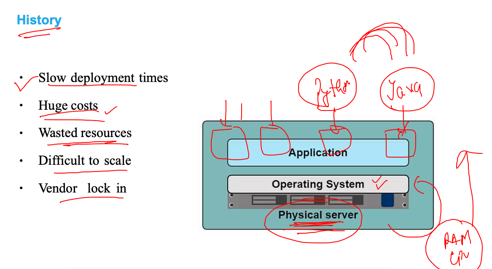

## intro to vm 

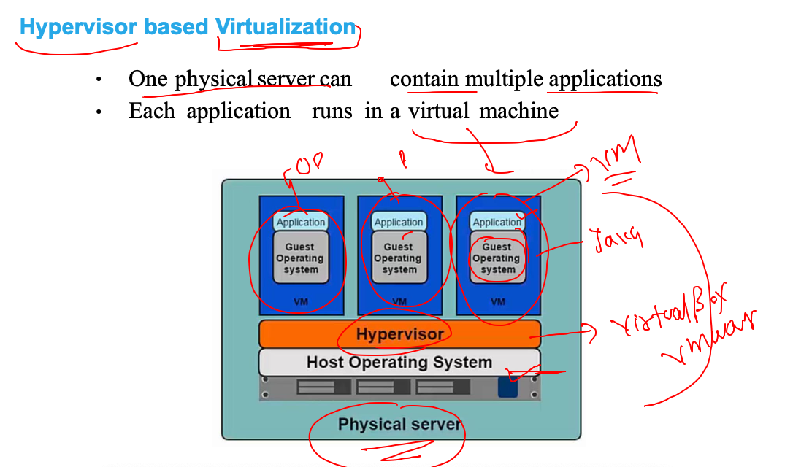

## understanding OS 

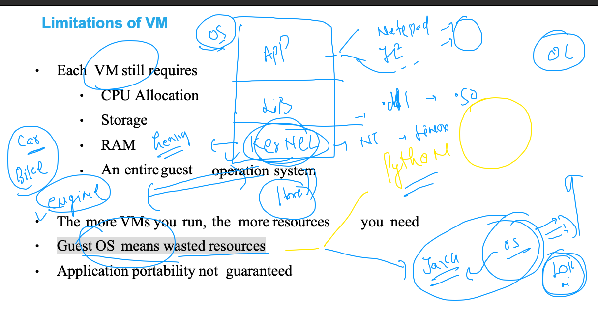

## Intro to container 

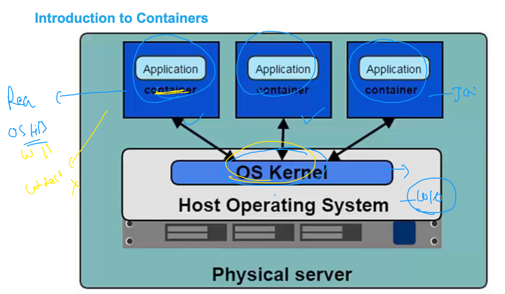

## journey from baremetal to containers

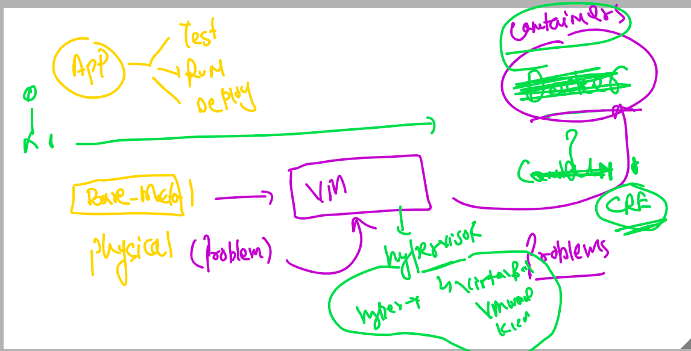

## Intro to CRE 

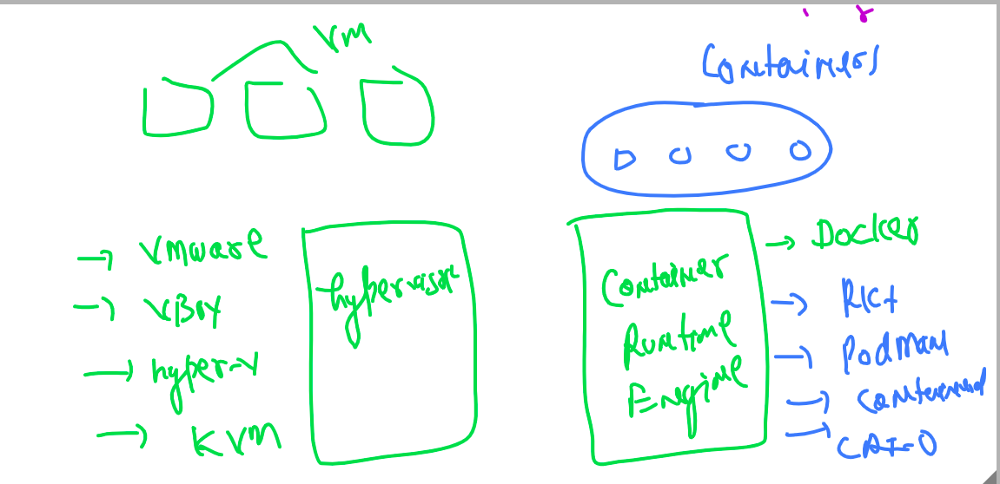

## Intro to docker  (CRE)

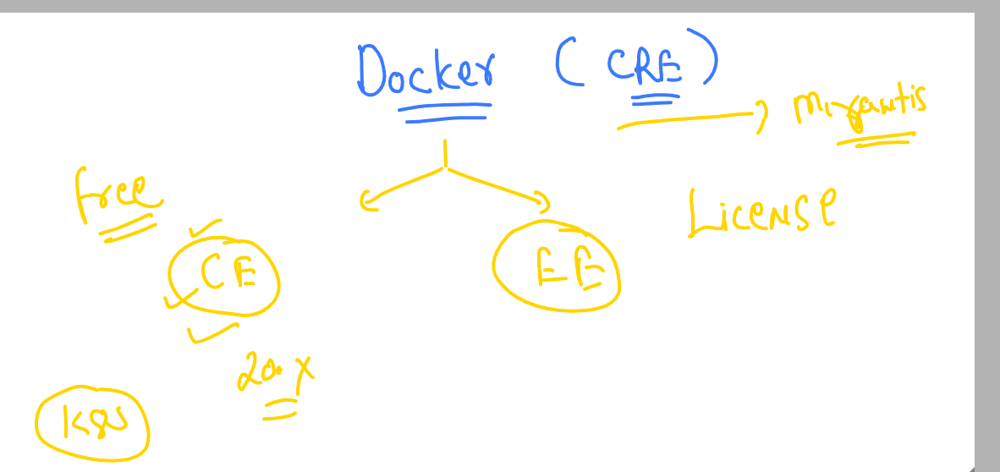

## docker supported kernel 

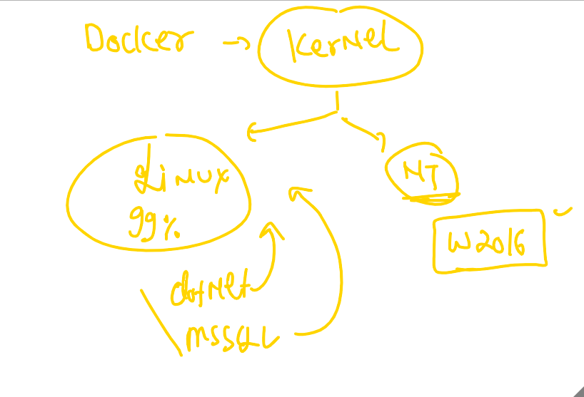

## Docker Desktop 

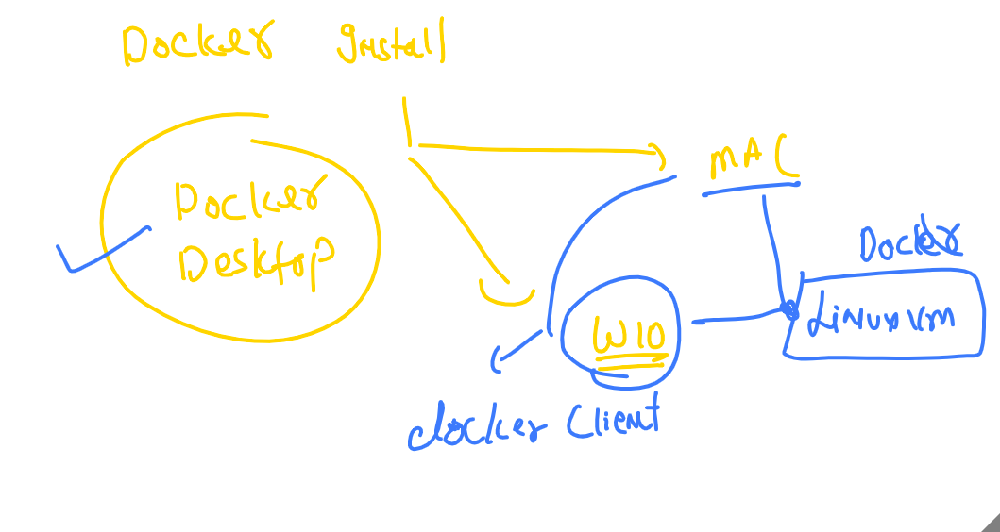

## Download docker Desktop 

[maclink](https://docs.docker.com/docker-for-mac/install/)

## checking docker installation 

```
❯ docker  version
Client:
 Cloud integration: 1.0.17
 Version:           20.10.7
 API version:       1.41
 Go version:        go1.16.4
 Git commit:        f0df350
 Built:             Wed Jun  2 11:56:22 2021
 OS/Arch:           darwin/amd64
 Context:           default
 Experimental:      true

Server: Docker Engine - Community
 Engine:
  Version:          20.10.7
  API version:      1.41 (minimum version 1.12)
  Go version:       go1.13.15
  Git commit:       b0f5bc3
  Built:            Wed Jun  2 11:54:58 2021
  OS/Arch:          linux/amd64
  Experimental:     false
 containerd:
  Version:          1.4.6
  GitCommit:        d71fcd7d8303cbf684402823e425e9dd2e99285d
 runc:
  Version:          1.0.0-rc95
  GitCommit:        b9ee9c6314599f1b4a7f497e1f1f856fe433d3b7
 docker-init:
  Version:          0.19.0
  GitCommit:        de40ad0


```

## Docker client and server architecture

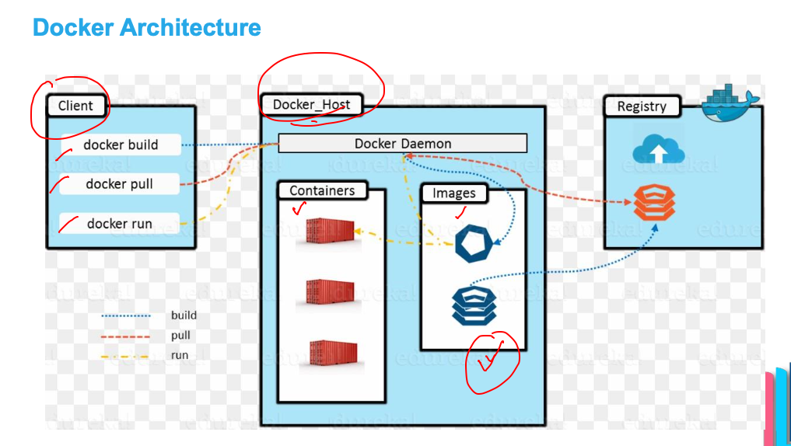

## docker. search  img operation 

```
❯ docker  search   java
NAME                                     DESCRIPTION                                     STARS     OFFICIAL   AUTOMATED
node                                     Node.js is a JavaScript-based platform for s…   10404     [OK]       
tomcat                                   Apache Tomcat is an open source implementati…   3095      [OK]       
openjdk                                  OpenJDK is an open-source implementation of …   2873      [OK]       
java                                     Java is a concurrent, class-based, and objec…   1976      [OK]       
ghost                                    Ghost is a free and open source blogging pla…   1398      [OK]       
couchdb                                  CouchDB is a database that uses JSON for doc…   430       [OK]       
jetty                                    Jetty provides a Web server and javax.servle…   369       [OK]       
groovy                                   Apache Groovy is a multi-faceted language fo…   114       [OK]       
lwieske/java-8                           Oracle Java 8 Container - 

```

## pulling docker img 

```
❯ docker  pull   openjdk
Using default tag: latest
latest: Pulling from library/openjdk
c67289558ae5: Pull complete 
12787f1f3888: Pull complete 
61bd18e93178: Pull complete 
Digest: sha256:ad240a929c34ed18ca8a4e1eec679813513391e74e882b15d69d9131ff72ec41
Status: Downloaded newer image for openjdk:latest
docker.io/library/openjdk:latest


```

### all docker engine images

```
❯ docker  images
REPOSITORY    TAG       IMAGE ID       CREATED        SIZE
openjdk       latest    f4489eef8885   3 days ago     467MB
oraclelinux   8.4       fcf3cbfc22ac   3 days ago     247MB
alpine        latest    021b3423115f   9 days ago     5.6MB
busybox       latest    69593048aa3a   2 months ago   1.24MB

```

### creating container 

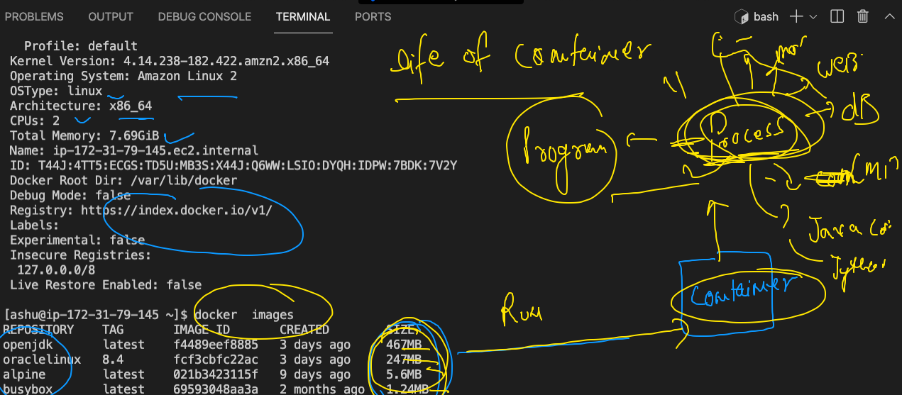

## creating first container 

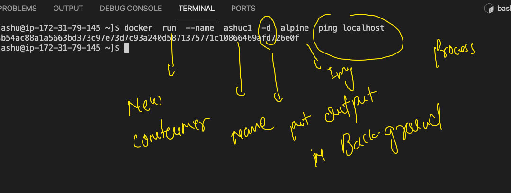

### list of running containers

```
[ashu@ip-172-31-79-145 ~]$ docker  ps
CONTAINER ID   IMAGE     COMMAND            CREATED              STATUS              PORTS     NAMES
47aa86f4af4f   alpine    "ping localhost"   About a minute ago   Up About a minute             jayac1
8b54ac88a1a5   alpine    "ping localhost"   About a minute ago   Up About a minute             ashuc1
[ashu@ip-172-31-79-145 ~]$ docker  ps


```

