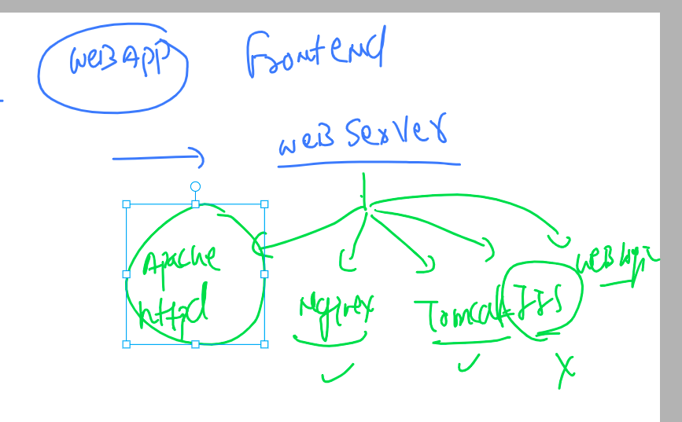
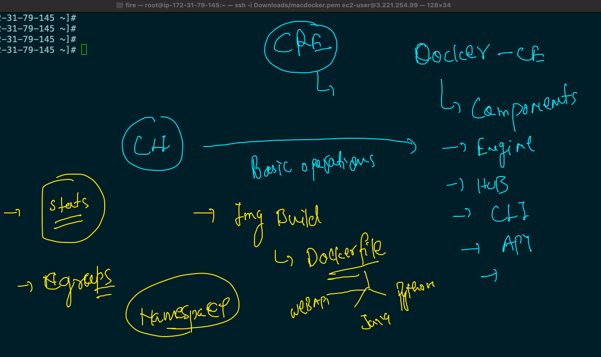
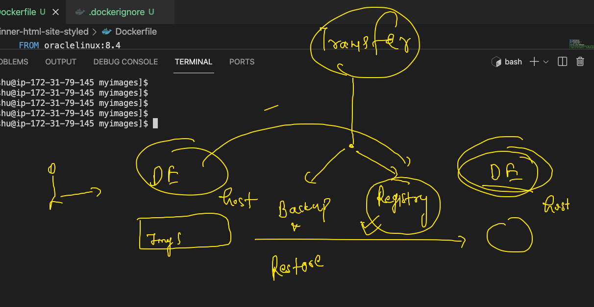
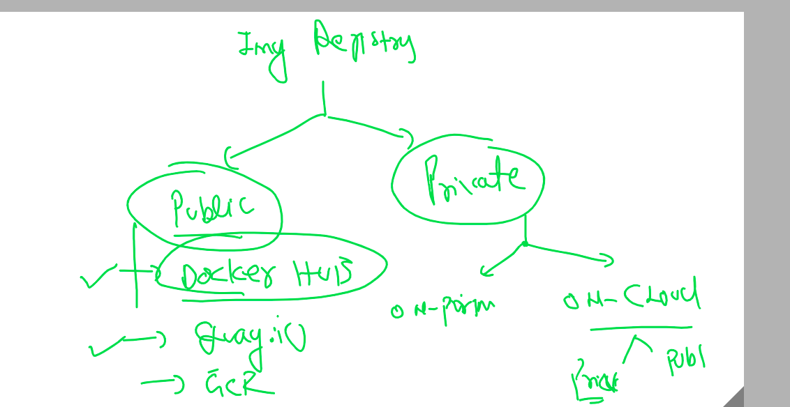
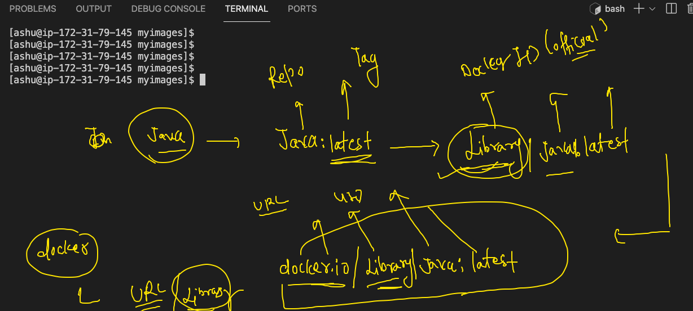
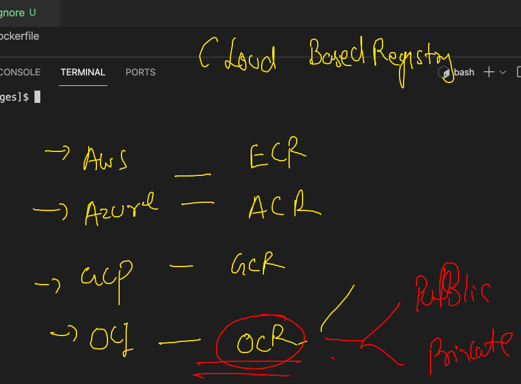

# Namespaces in Docker & containers


## Intro to Cgroups 


## 

```
172  docker  run -tid --name ashuc1  oraclelinux:8.4  ping fb.com 
  173  docker  ps
  174  docker  stats
  175  history 
  176  docker  exec  -itd  ashuc1  ping google.com 
  177  docker  stats
  178  docker  top  ashuc1
  
```

## LImit Ram 

```
 docker  run -itd --name ashuc2  --memory 100m alpine ping fb.com 
 
```

### limit ram and cpu 

```
docker  run -itd --name ashuc3 --cpu-shares=20   --memory 100m alpine ping fb.com
```

### restart policy 

[restart policy](https://docs.docker.com/config/containers/start-containers-automatically/)


## putting restart policy 

```
docker  run -itd --name myname --restart always alpine ping localhost

```

### building java based image 

```
[ashu@ip-172-31-79-145 javacode]$ docker  build  -t  ashujava:v1  . 
Sending build context to Docker daemon  3.072kB
Step 1/7 : FROM openjdk
 ---> f4489eef8885
Step 2/7 : LABEL name=ashutoshh
 ---> Running in 68177992bdd9
Removing intermediate container 68177992bdd9
 ---> ab3054b31d0a
Step 3/7 : RUN mkdir /jcode
 ---> Running in 407a6bba13e9
Removing intermediate container 407a6bba13e9
 ---> 0724490b4758
Step 4/7 : ADD hello.java  /jcode/hello.java
 ---> 886a776e77dd
Step 5/7 : WORKDIR  /jcode
 ---> Running in 8c34640a6bd2
Removing intermediate container 8c34640a6bd2
 ---> 55ad684ca817
Step 6/7 : RUN javac  hello.java
 ---> Running in 84eaa6d18d14
Removing intermediate container 84eaa6d18d14
 ---> af815d67d928
Step 7/7 : CMD ["java","myclass"]
 ---> Running in 801832c7da62
Removing intermediate container 801832c7da62
 ---> b74137e6f206
Successfully built b74137e6f206
Successfully tagged ashujava:v1

```

### creation container 

```
 docker  run -itd --name jvashuc1  ashujava:v1  
  208  docker  ps
  209  docker  logs -f  jvashuc1
  210  history 
  211  docker  stats
  
```

### checking java container details 

```
[ashu@ip-172-31-79-145 myimages]$ docker  exec -it  jvashuc1  bash 
bash-4.4# java -version 
openjdk version "16.0.2" 2021-07-20
OpenJDK Runtime Environment (build 16.0.2+7-67)
OpenJDK 64-Bit Server VM (build 16.0.2+7-67, mixed mode, sharing)
bash-4.4# 
bash-4.4# 
bash-4.4# cat  /etc/os-release 
NAME="Oracle Linux Server"
VERSION="8.4"
ID="ol"
ID_LIKE="fedora"
VARIANT="Server"
VARIANT_ID="server"
VERSION_ID="8.4"
PLATFORM_ID="platform:el8"
PRETTY_NAME="Oracle Linux Server 8.4"
ANSI_COLOR="0;31"
CPE_NAME="cpe:/o:oracle:linux:8:4:server"
HOME_URL="https://linux.oracle.com/"
BUG_REPORT_URL="https://bugzilla.oracle.com/"

ORACLE_BUGZILLA_PRODUCT="Oracle Linux 8"
ORACLE_BUGZILLA_PRODUCT_VERSION=8.4
ORACLE_SUPPORT_PRODUCT="Oracle Linux"
ORACLE_SUPPORT_PRODUCT_VERSION=8.4

```

### building image 

```
ashu@ip-172-31-79-145 myimages]$ cd  javacode/
[ashu@ip-172-31-79-145 javacode]$ ls
Dockerfile  hello.java  jdk8.dockerfile
[ashu@ip-172-31-79-145 javacode]$ docker  build -t  ashujava:v2  -f  jdk8.dockerfile  . 
Sending build context to Docker daemon  4.096kB
Step 1/8 : FROM oraclelinux:8.4
 ---> fcf3cbfc22ac
Step 2/8 : LABEL name=ashutoshh
 ---> Using cache
 ---> 6ac21e84f537
Step 3/8 : RUN  dnf install java-1.8.0-openjdk.x86_64 java-1.8.0-openjdk-devel.x86_64 -y
 ---> Running in bfb52c66f712
```

### webapp containerization 



### DNFs installing httpd 

```
[ashu@ip-172-31-79-145 beginner-html-site-styled]$ ls
CODE_OF_CONDUCT.md  Dockerfile  images  index.html  LICENSE  README.md  styles
[ashu@ip-172-31-79-145 beginner-html-site-styled]$ docker build -t  ashuhttpd:aug17th2021 . 
Sending build context to Docker daemon  63.49kB
Step 1/5 : FROM oraclelinux:8.4
 ---> fcf3cbfc22ac
Step 2/5 : LABEL name=ashutoshh
 ---> Using cache
 ---> 6ac21e84f537
Step 3/5 : RUN dnf install httpd -y
 ---> Running in fd2b9ca4f3b8

```
### creating 

```
 docker  run -itd  --name ashuwebc1  -p  1234:80   ashuhttpd:aug17th2021
```

### docker recap 



## image sharing 



## Docker public registry 



## docker image name 



## docker hub image push 

```
[ashu@ip-172-31-79-145 myimages]$ docker  tag   ashuhttpd:aug17th2021  dockerashu/ashuhttpd:aug17th2021 
[ashu@ip-172-31-79-145 myimages]$ 
[ashu@ip-172-31-79-145 myimages]$ 
[ashu@ip-172-31-79-145 myimages]$ docker  login -u  dockerashu
Password: 
WARNING! Your password will be stored unencrypted in /home/ashu/.docker/config.json.
Configure a credential helper to remove this warning. See
https://docs.docker.com/engine/reference/commandline/login/#credentials-store

Login Succeeded
[ashu@ip-172-31-79-145 myimages]$ docker  push  dockerashu/ashuhttpd:aug17th2021 
The push refers to repository [docker.io/dockerashu/ashuhttpd]
0d7372999182: Pushed 
3cf5b4d5d8b0: Pushed 
89ca13798c53: Mounted from library/oraclelinux 
aug17th2021: digest: sha256:9a1ac822cd2c7a36e64c4b66260ce7c74883f60cb45013019d88dbd92d91bce0 size: 951
[ashu@ip-172-31-79-145 myimages]$ docker  logout 
Removing login credentials for https://index.docker.io/v1/


```


### from a different docker engine 

```
❯ docker  pull dockerashu/ashuhttpd:aug17th2021
aug17th2021: Pulling from dockerashu/ashuhttpd
2d6c3304745e: Already exists 
14f175d153cf: Pull complete 
c75d42f4581e: Pull complete 
Digest: sha256:9a1ac822cd2c7a36e64c4b66260ce7c74883f60cb45013019d88dbd92d91bce0
Status: Downloaded newer image for dockerashu/ashuhttpd:aug17th2021
docker.io/dockerashu/ashuhttpd:aug17th2021
❯ docker  images
REPOSITORY             TAG           IMAGE ID       CREATED        SIZE
dockerashu/ashuhttpd   aug17th2021   ceb1faf02f8a   2 hours ago    394MB
openjdk                latest        f4489eef8885   4 days ago     467MB
oraclelinux            8.4           fcf3cbfc22ac   4 days ago     247MB
alpine                 latest        021b3423115f   10 days ago    5.6MB
busybox                latest        69593048aa3a   2 months ago   1.24MB


```

## cloud based registry 



