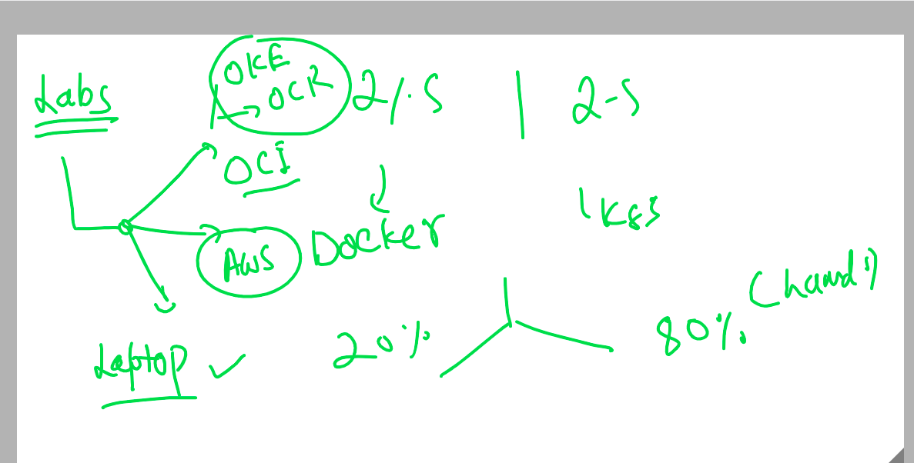

#  training plan 

## app deployment in past 

## intro to vm 

## understanding OS 

## Intro to container 

## journey from baremetal to containers

## Intro to CRE 

## Intro to docker  (CRE)

## docker supported kernel 

## Docker Desktop 

## Download docker Desktop 

[maclink](https://docs.docker.com/docker-for-mac/install/)

