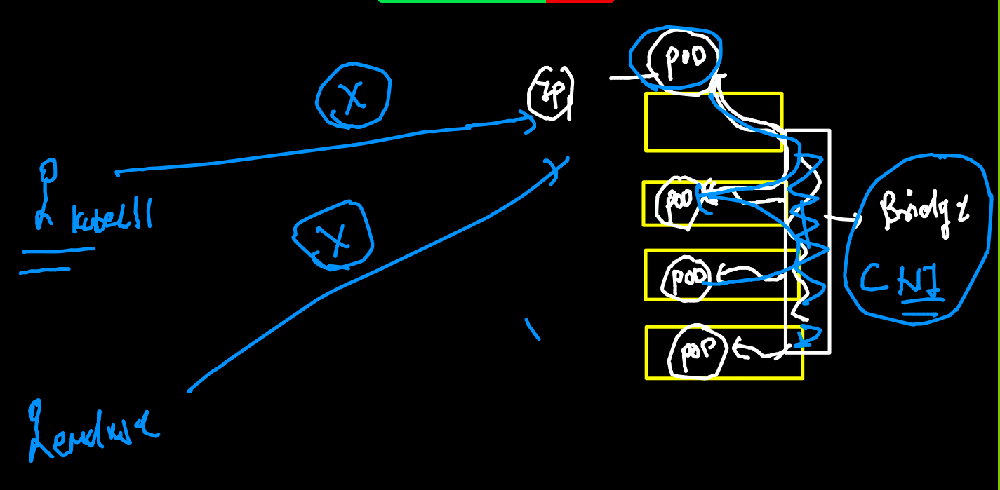

# k8s Revision 


## k8s client story 


## token config file in k8s cluster side 

```
root@masternode ~]# cd  /etc/kubernetes/
[root@masternode kubernetes]# ls
admin.conf  controller-manager.conf  kubelet.conf  manifests  pki  scheduler.conf
[root@masternode kubernetes]# 

```

### kubectl read  k8s master auth details  from  home directory or any user in any os under .kube/config file 


## COnnecting and switching to multi k8s cluster using context concept 

```
❯ minikube update-context
🎉  "minikube" context has been updated to point to 127.0.0.1:51739
💗  Current context is "minikube"
❯ kubectl  get  nodes
NAME       STATUS   ROLES                  AGE     VERSION
minikube   Ready    control-plane,master   7d18h   v1.21.2
❯ kubectl  config  get-contexts
CURRENT   NAME                          CLUSTER      AUTHINFO           NAMESPACE
          kubernetes-admin@kubernetes   kubernetes   kubernetes-admin   
*         minikube                      minikube     minikube           
❯ 
❯ kubectl  config  use-context  kubernetes-admin@kubernetes
Switched to context "kubernetes-admin@kubernetes".
❯ kubectl  get  nodes
NAME         STATUS   ROLES                  AGE   VERSION
masternode   Ready    control-plane,master   77m   v1.22.0
minion1      Ready    <none>                 75m   v1.22.0
minion2      Ready    <none>                 74m   v1.22.0
❯ 
❯ kubectl  config  get-contexts
CURRENT   NAME                          CLUSTER      AUTHINFO           NAMESPACE
*         kubernetes-admin@kubernetes   kubernetes   kubernetes-admin   
          minikube                      minikube     minikube           
❯ kubectl  config  use-context  minikube
Switched to context "minikube".
❯ kubectl  get  nodes
NAME       STATUS   ROLES                  AGE     VERSION
minikube   Ready    control-plane,master   7d18h   v1.21.2


```

## introduction to POD


### checking snyntax of YAML 

```
❯ kubectl  apply -f  ashupod1.yaml --dry-run=client
pod/ashupod-1 created (dry run)

```

### deploy pod 

```
❯ kubectl  apply -f  ashupod1.yaml
pod/ashupod-1 created
❯ kubectl  get  pods
NAME        READY   STATUS    RESTARTS   AGE
ashupod-1   1/1     Running   0          8s

```

### checking pods 

```
❯ kubectl  get pods
NAME           READY   STATUS    RESTARTS   AGE
ashupod-1      1/1     Running   0          9m18s
karthikpod-1   1/1     Running   0          5m4s
padma-1        1/1     Running   0          2m33s
poorvipod-1    1/1     Running   0          8m25s
sahilpod-1     1/1     Running   0          112s
skpod-1        1/1     Running   0          7m52s
srinipod-1     1/1     Running   0          8m53s
yashpod-1      1/1     Running   0          4m25s

```


##  deleting pods 

```
kubectl  delete  pod  sahilpod-1

```


### checking output of container inside pod 

```
kubectl  logs  -f  ashupod-1

```

### checking scheduling of pod 

```
❯ kubectl  get pod ashupod-1  -o wide
NAME        READY   STATUS    RESTARTS   AGE   IP                NODE      NOMINATED NODE   READINESS GATES
ashupod-1   1/1     Running   0          12m   192.168.179.196   minion2   <none>           <none>

```

## accessing container inside pod 

```
❯ kubectl  exec -it  ashupod-1  -- sh
/ # 
/ # cat  /etc/os-release 
NAME="Alpine Linux"
ID=alpine
VERSION_ID=3.14.1
PRETTY_NAME="Alpine Linux v3.14"
HOME_URL="https://alpinelinux.org/"
BUG_REPORT_URL="https://bugs.alpinelinux.org/"
/ # exit


```
### Generate YAML file 

```
❯ kubectl  run  ashuwebpod  --image=dockerashu/customer1:v1  --dry-run=client  -o yaml
apiVersion: v1
kind: Pod
metadata:
  creationTimestamp: null
  labels:
    run: ashuwebpod
  name: ashuwebpod
spec:
  containers:
  - image: dockerashu/customer1:v1
    name: ashuwebpod
    resources: {}
  dnsPolicy: ClusterFirst
  restartPolicy: Always
status: {}

```

### JSON file generate 

```
 kubectl  run  ashuwebpod  --image=dockerashu/customer1:v1  --dry-run=client  -o json
{
    "kind": "Pod",
    "apiVersion": "v1",
    "metadata": {
        "name": "ashuwebpod",
        "creationTimestamp": null,
        "labels": {
            "run": "ashuwebpod"
        }
       
       
```

### generate yaml and save in a file 

```
kubectl  run  ashuwebpod  --image=dockerashu/customer1:v1  --dry-run=client  -o yaml    >ashuweb.yaml

```

### kubectl replace. 

```
❯ kubectl  replace  -f  ashuweb.yaml --force
pod "ashuwebpod" deleted
pod/ashuwebpod replaced
❯ kubectl  get  po -o wide
NAME           READY   STATUS    RESTARTS   AGE     IP                NODE      NOMINATED NODE   READINESS GATES
ashuwebpod     1/1     Running   0          5s      192.168.34.17     minion1   <none>           <none>
jayawebpod     1/1     Running   0          2m7s    192.168.34.15     minion1   <none>           <none>

```

### Describe POD 

```
❯ kubectl  describe  pod  ashuwebpod
Name:         ashuwebpod
Namespace:    default
Priority:     0
Node:         minion1/172.31.60.77
Start Time:   Thu, 19 Aug 2021 11:39:34 +0530
Labels:       run=ashuwebpod
Annotations:  cni.projectcalico.org/containerID: a086370abef4ce914bc8c5c7298aea8f8a2529119d49be618332967a8956c75b
              cni.projectcalico.org/podIP: 192.168.34.17/32
              cni.projectcalico.org/podIPs: 192.168.34.17/32
Status:       Running
IP:           192.168.34.17
IPs:
  IP:  192.168.34.17
Containers:
  ashuwebpod:
    Container ID:   docker://48d33bdae7b2f1487e012a30b1b7ff48d9a99364b65d192f7bfe389ed1dd79f6
    Image:          dockerashu/customer1:v1
    Image ID:       docker-pullable://dockerashu/customer1@sha256:651c5a1bcd0c473c18e0d8c254d6685a5d8013dd3c6c70e8889b6adefcf46de1
    Port:           <none>
    Host Port:      <none>
    State:          Running
      Started:      Thu, 19 Aug 2021 11:39:36 +0530
    Ready:          True
    Restart Count:  0
    Environment:
      myapp:  app3
    Mounts:
      /var/run/secrets/kubernetes.io/serviceaccount from kube-api-access-vdn6p (ro)
Conditions:
  Type              Status
  Initialized       True 
  Ready             True 
  ContainersReady   True 
  PodScheduled      True 
Volumes:


```

## POD networking 


## POd IP address is only can be accssed from Minion only 


### port-forward 



 ### intor to service 
 
 
 
 ## type of service 
 
 
 
 ## Nodeport 
 
 
 
 ## svc will find pod using label 
 
 ### checking label 
 
 ```
 ❯ kubectl  get  po  ashuwebpod  --show-labels
NAME         READY   STATUS    RESTARTS   AGE    LABELS
ashuwebpod   1/1     Running   0          166m   run=ashuwebpod
❯ kubectl  get  po   --show-labels
NAME            READY   STATUS    RESTARTS   AGE    LABELS
ashuwebpod      1/1     Running   0          166m   run=ashuwebpod
jayawebpod      1/1     Running   0          164m   run=jayawebpod
karthikwebpod   1/1     Running   0          165m   run=karthikwebpod
neetuwebpod     1/1     Running   0          170m   run=neetuwebpod
padmawebpod     1/1     Running   0          169m   run=padmawebpod
poorviwebpod    1/1     Running   0          171m   run=poorviwebpod
```
### to create service 

```
❯ kubectl  create  service
Create a service using specified subcommand.

Aliases:
service, svc

Available Commands:
  clusterip    Create a ClusterIP service.
  externalname Create an ExternalName service.
  loadbalancer Create a LoadBalancer service.
  nodeport     Create a NodePort service.
  
  ```
  
  ### creating service 
  
  ```
  ❯ kubectl  create  service   nodeport  ashusvc1  --tcp  1234:80  --dry-run=client  -o yaml
apiVersion: v1
kind: Service
metadata:
  creationTimestamp: null
  labels:
    app: ashusvc1
  name: ashusvc1
spec:
  ports:
  - name: 1234-80
    port: 1234
    protocol: TCP
    targetPort: 80
  selector:
    app: ashusvc1
  type: NodePort
status:
  loadBalancer: {}
❯ kubectl  create  service   nodeport  ashusvc1  --tcp  1234:80  --dry-run=client  -o yaml   >ashusvc.yaml


```

### create service 

```
❯ ls
ashupod1.yaml ashusvc.yaml  ashuweb.yaml
❯ kubectl  apply -f  ashusvc.yaml --dry-run=client
service/ashusvc1 created (dry run)
❯ kubectl  apply -f  ashusvc.yaml
service/ashusvc1 created
❯ kubectl  get  service
NAME            TYPE        CLUSTER-IP      EXTERNAL-IP   PORT(S)          AGE
ashusvc1        NodePort    10.106.10.33    <none>        1234:32658/TCP   11s
kubernetes      ClusterIP   10.96.0.1       <none>        443/TCP          5h30m
sahilservice1   NodePort    10.97.222.155   <none>        7855:31510/TCP   89s

```


 
