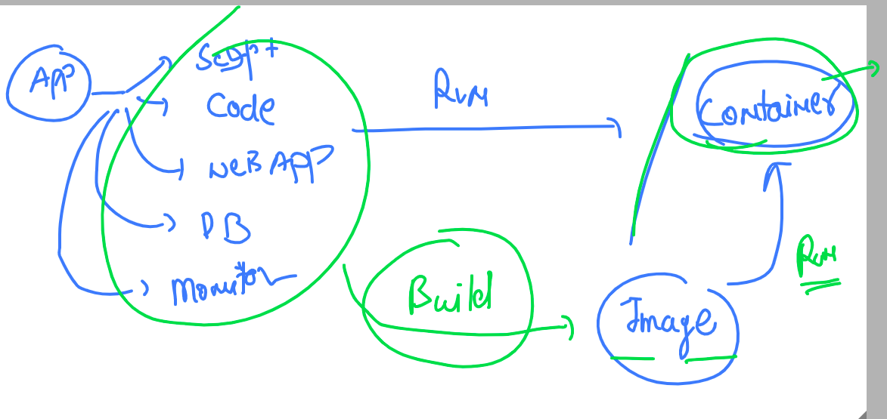
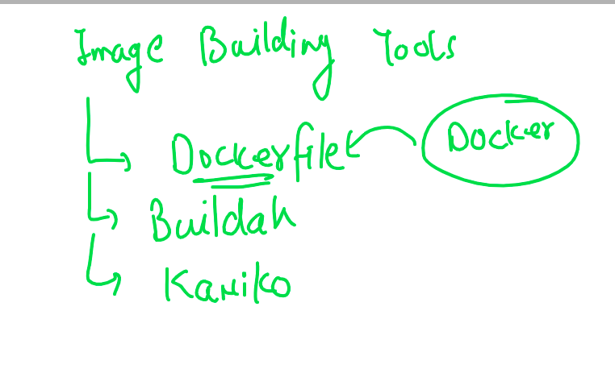
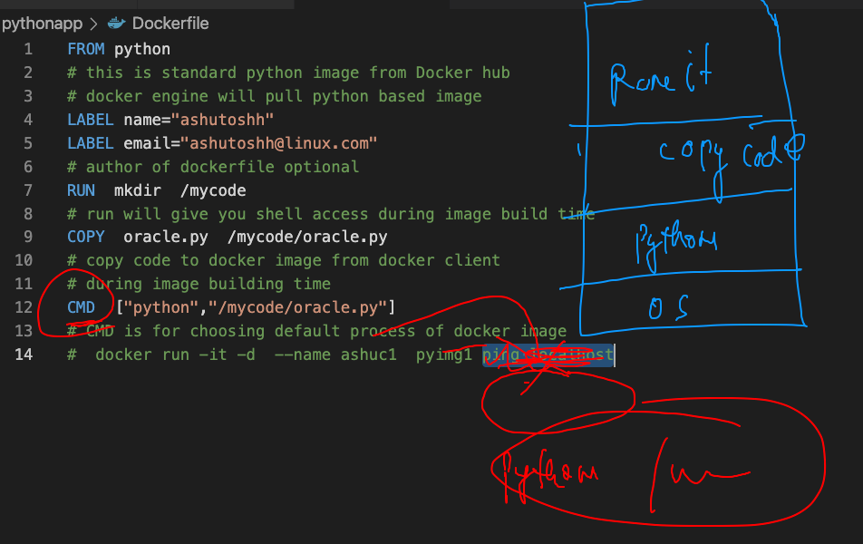

#  training plan 


## app deployment in past 


## intro to vm 


## understanding OS 


## Intro to container 


## journey from baremetal to containers


## Intro to CRE 


## Intro to docker  (CRE)


## docker supported kernel 


## Docker Desktop 


## Download docker Desktop 

[maclink](https://docs.docker.com/docker-for-mac/install/)

## checking docker installation 

```
❯ docker  version
Client:
 Cloud integration: 1.0.17
 Version:           20.10.7
 API version:       1.41
 Go version:        go1.16.4
 Git commit:        f0df350
 Built:             Wed Jun  2 11:56:22 2021
 OS/Arch:           darwin/amd64
 Context:           default
 Experimental:      true

Server: Docker Engine - Community
 Engine:
  Version:          20.10.7
  API version:      1.41 (minimum version 1.12)
  Go version:       go1.13.15
  Git commit:       b0f5bc3
  Built:            Wed Jun  2 11:54:58 2021
  OS/Arch:          linux/amd64
  Experimental:     false
 containerd:
  Version:          1.4.6
  GitCommit:        d71fcd7d8303cbf684402823e425e9dd2e99285d
 runc:
  Version:          1.0.0-rc95
  GitCommit:        b9ee9c6314599f1b4a7f497e1f1f856fe433d3b7
 docker-init:
  Version:          0.19.0
  GitCommit:        de40ad0


```

## Docker client and server architecture


## docker. search  img operation 

```
❯ docker  search   java
NAME                                     DESCRIPTION                                     STARS     OFFICIAL   AUTOMATED
node                                     Node.js is a JavaScript-based platform for s…   10404     [OK]       
tomcat                                   Apache Tomcat is an open source implementati…   3095      [OK]       
openjdk                                  OpenJDK is an open-source implementation of …   2873      [OK]       
java                                     Java is a concurrent, class-based, and objec…   1976      [OK]       
ghost                                    Ghost is a free and open source blogging pla…   1398      [OK]       
couchdb                                  CouchDB is a database that uses JSON for doc…   430       [OK]       
jetty                                    Jetty provides a Web server and javax.servle…   369       [OK]       
groovy                                   Apache Groovy is a multi-faceted language fo…   114       [OK]       
lwieske/java-8                           Oracle Java 8 Container - 

```

## pulling docker img 

```
❯ docker  pull   openjdk
Using default tag: latest
latest: Pulling from library/openjdk
c67289558ae5: Pull complete 
12787f1f3888: Pull complete 
61bd18e93178: Pull complete 
Digest: sha256:ad240a929c34ed18ca8a4e1eec679813513391e74e882b15d69d9131ff72ec41
Status: Downloaded newer image for openjdk:latest
docker.io/library/openjdk:latest


```

### all docker engine images

```
❯ docker  images
REPOSITORY    TAG       IMAGE ID       CREATED        SIZE
openjdk       latest    f4489eef8885   3 days ago     467MB
oraclelinux   8.4       fcf3cbfc22ac   3 days ago     247MB
alpine        latest    021b3423115f   9 days ago     5.6MB
busybox       latest    69593048aa3a   2 months ago   1.24MB

```

### creating container 


## creating first container 


### list of running containers

```
[ashu@ip-172-31-79-145 ~]$ docker  ps
CONTAINER ID   IMAGE     COMMAND            CREATED              STATUS              PORTS     NAMES
47aa86f4af4f   alpine    "ping localhost"   About a minute ago   Up About a minute             jayac1
8b54ac88a1a5   alpine    "ping localhost"   About a minute ago   Up About a minute             ashuc1
[ashu@ip-172-31-79-145 ~]$ docker  ps


```

## checking resource consumption 

```
docker stats

CONTAINER ID   NAME              CPU %     MEM USAGE / LIMIT   MEM %     NET I/O       BLOCK I/O     PIDS
305600e6acb0   skumar_firstcon   0.01%     628KiB / 7.69GiB    0.01%     1.13kB / 0B   0B / 0B       1
3cbb69c2bb48   srini2            0.01%     664KiB / 7.69GiB    0.01%     1.13kB / 0B   0B / 0B       1
394c8c79e285   padma1            0.01%     692KiB / 7.69GiB    0.01%     1.06kB / 0B   0B / 0B       1
7dbd97571d60   SK1               0.00%     732KiB / 7.69GiB    0.01%     1.47kB / 0B   0B / 0B       1
228dbe97bd9a   mycont_praveen    0.01%     604KiB / 7.69GiB    0.01%     1.47kB / 0B   0B / 0B       1
eaf879474506   karthik           0.01%     660KiB / 7.69GiB    0.01%     1.47kB / 0B   0B / 0B       1
7a440bec28a5   yashC1            0.01%     656KiB / 7.69GiB    0.01%     1.47kB / 0B   0B / 0B       1
03b0dfc9601c   poorvi91          0.01%     708KiB / 7.69GiB    0.01%     1.47kB / 0B   0B / 0B       1
990085dc9fd1   sriram            0.01%     656KiB / 7.69GiB    0.01%     1

```

### stopping containre 

```
[ashu@ip-172-31-79-145 ~]$ docker  stop   ashuc1 
ashuc1
[ashu@ip-172-31-79-145 ~]$ docker  ps
CONTAINER ID   IMAGE     COMMAND            CREATED             STATUS             PORTS     NAMES
3cbb69c2bb48   alpine    "ping localhost"   About an hour ago   Up About an hour             srini2
394c8c79e285   alpine    "ping localhost"   About an hour ago   Up About an hour             padma1
7dbd97571d60   alpine    "ping localhost"   About an hour ago   Up About an hour             SK1
228dbe97bd9a   alpine    "ping localhost"   About an hour ago   Up About an hour             mycont_praveen
eaf879474506   alpine    "ping localhost"   About an hour ago   Up About an hour             karthik
7a440bec28a5   alpine    "ping localhost"   About an hour ago   Up About an hour             yashC1
03b0dfc9601c   alpine    "ping localhost"   About an hour ago   Up About an hour             poorvi91
990085dc9fd1   alpine    "ping localhost"   About an hour ago   Up About an hour             sriram
47aa86f4af4f   alpine    "ping localhost"   2 hours ago         Up 2 hours                   jayac1


```

### starting container 

```
[ashu@ip-172-31-79-145 ~]$ docker  start  ashuc1 
ashuc1
[ashu@ip-172-31-79-145 ~]$ docker  ps
CONTAINER ID   IMAGE     COMMAND            CREATED             STATUS             PORTS     NAMES
3cbb69c2bb48   alpine    "ping localhost"   About an hour ago   Up About an hour             srini2
228dbe97bd9a   alpine    "ping localhost"   About an hour ago   Up About an hour             mycont_praveen
eaf879474506   alpine    "ping localhost"   About an hour ago   Up About an hour             karthik
990085dc9fd1   alpine    "ping localhost"   About an hour ago   Up About an hour             sriram
8b54ac88a1a5   alpine    "ping localhost"   2 hours ago         Up 5 seconds                 ashuc1

```

### check ouput of container process live 

```
 docker  logs  -f  ashuc1
  docker  logs  ashuc1 # non live 
```

### loggin into running container 

```
[ashu@ip-172-31-79-145 ~]$ docker  exec  -it   ashuc1  sh 
/ # 
/ # 
/ # cat  /etc/os-release 
NAME="Alpine Linux"
ID=alpine
VERSION_ID=3.14.1
PRETTY_NAME="Alpine Linux v3.14"
HOME_URL="https://alpinelinux.org/"
BUG_REPORT_URL="https://bugs.alpinelinux.org/"
/ # whoami
root
/ # exit


```

### kill all container 

```
docker   kill  $(docker  ps  -q)

```

### starting all container 

```
docker  start  $(docker  ps -aq)

```

### deleting container 

```
[ashu@ip-172-31-79-145 ~]$ docker rm ashuc1
ashuc1

```

### deleting only non running container 

```
ashu@ip-172-31-79-145 ~]$docker  rm  $(docker ps -aq)
f4edefcdb863
305600e6acb0
ef7411ae0847
3cbb69c2bb48
35d98f5a0a79
19444a7e49ec
7dbd97571d60
228dbe97bd9a
eaf879474506
7a440bec28a5
03b0dfc9601c
990085dc9fd1
399ccf60f8ce
47aa86f4af4f

```

### app containerization 



### Docker build tools 



## Building python code based docker. image



### build process

```
[ashu@ip-172-31-79-145 myimages]$ ls
javacode  pythonapp
[ashu@ip-172-31-79-145 myimages]$ cd  pythonapp/
[ashu@ip-172-31-79-145 pythonapp]$ ls
Dockerfile  oracle.py
[ashu@ip-172-31-79-145 pythonapp]$ docker  build  -t  ashupython:v1  .  
Sending build context to Docker daemon  3.584kB
Step 1/6 : FROM python
latest: Pulling from library/python
627b765e08d1: Pull complete 
c040670e5e55: Pull complete 
073a180f4992: Pull complete 
bf76209566d0: Pull complete 
ca7044ed766e: Extracting  138.7MB/192.4MB
7b16520e0e66: Download complete 


```

### creating container 

```
[ashu@ip-172-31-79-145 ~]$ docker run -itd --name ashupc1  ashupython:v1  
325743e848982db70e238d653f1cf1ea1b7e3b09776a844b5ec2295613d1fbea
[ashu@ip-172-31-79-145 ~]$ docker  ps
CONTAINER ID   IMAGE           COMMAND                  CREATED              STATUS              PORTS     NAMES
325743e84898   ashupython:v1   "python /mycode/orac…"   15 seconds ago       Up 13 seconds                 ashupc1

```


### Building docker image 

```
[ashu@ip-172-31-79-145 pythonapp]$ docker  build  -t  ashupython:v2 -f OL.dockerfile  . 
Sending build context to Docker daemon   5.12kB
Step 1/7 : FROM oraclelinux:8.4
 ---> fcf3cbfc22ac
Step 2/7 : LABEL name="ashutoshh"
 ---> Running in 0d486c747237
Removing intermediate container 0d486c747237
 ---> 6ac21e84f537
Step 3/7 : LABEL email="ashutoshh@linux.com"
 ---> Running in a9b4cfdcad7c
Removing intermediate container a9b4cfdcad7c
 ---> 679cf77509b5
Step 4/7 : RUN  dnf install python3 -y
 ---> Running in bc7be7de9b5a
 
 ```
 
 ### building images
 
 ```
 143  docker  build -t ashupython:v3 -f  alpine.dockerfile  . 
  144  history 
[ashu@ip-172-31-79-145 pythonapp]$ docker  images  |   grep -i ashu
ashupython       v3        031de84a9894   9 seconds ago            53.9MB
ashupython       v2        d99da7abba43   19 minutes ago           396MB
ashupython       v1        dc02afe84e69   About an hour ago        886MB

```


