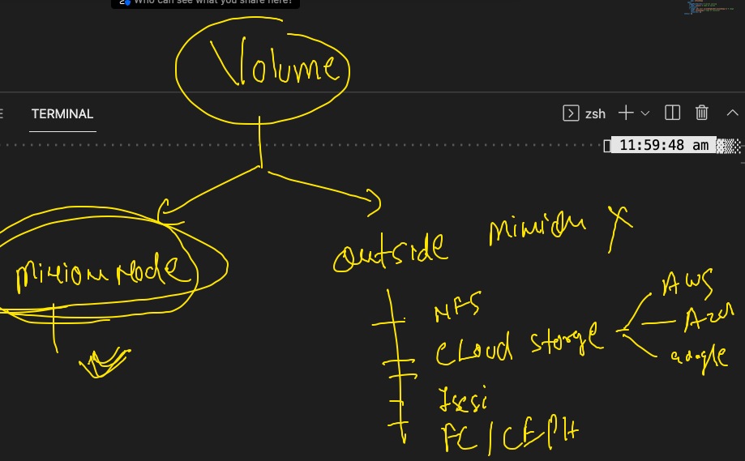

# java web app deploy 


### pushing image to OCR 

```
3142  docker  tag   ashujavaweb:v1     phx.ocir.io/axmbtg8judkl/javawebapp:v1 
 3143  docker  images
 3144  docker login 
 3145  docker login   phx.ocir.io  -u axmbtg8judkl/learntechbyme@gmail.com 
❯ docker  push  phx.ocir.io/axmbtg8judkl/javawebapp:v1
The push refers to repository [phx.ocir.io/axmbtg8judkl/javawebapp]
290b0843ebc4: Pushed 
5f70bf18a086: Pushed 
1c7a4aac8a54: Pushed 
19f8bd134bcf: Pushed 
83a14c3e974e: Pushing [=====>                                    

```

### creating YAML for tomcat app 

```
❯ kubectl   run  ashujavaapp  --image=phx.ocir.io/axmbtg8judkl/javawebapp:v1  --port 8080  --dry-run=client -o yaml
apiVersion: v1
kind: Pod
metadata:
  creationTimestamp: null
  labels:
    run: ashujavaapp
  name: ashujavaapp
spec:
  containers:
  - image: phx.ocir.io/axmbtg8judkl/javawebapp:v1
    name: ashujavaapp
    ports:
    - containerPort: 8080
    resources: {}
  dnsPolicy: ClusterFirst
  restartPolicy: Always
status: {}
❯ kubectl   run  ashujavaapp  --image=phx.ocir.io/axmbtg8judkl/javawebapp:v1  --port 8080  --dry-run=client -o yaml  >tomcat.yaml

```

### creating secret command 

```
kubectl  create  secret   docker-registry    ashuocr  --docker-server=phx.ocir.io  --docker-username=axmbtg8judkl/learntechbyme@gmail.com  --docker-password="NlvC"

```

## deploy pod with secret. 

```
❯ kubectl  replace  -f  tomcat.yaml --force
pod "ashujavaapp" deleted
pod/ashujavaapp replaced
❯ kubectl  get  po
NAME          READY   STATUS              RESTARTS   AGE
ashujavaapp   0/1     ContainerCreating   0          6s
❯ kubectl  get  po
NAME          READY   STATUS              RESTARTS   AGE
ashujavaapp   0/1     ContainerCreating   0          21s
❯ kubectl  get  po
NAME          READY   STATUS    RESTARTS   AGE
ashujavaapp   1/1     Running   0          43s
❯ kubectl  get  po  -o wide
NAME          READY   STATUS    RESTARTS   AGE   IP                NODE      NOMINATED NODE   READINESS GATES
ashujavaapp   1/1     Running   0          49s   192.168.179.234   minion2   <none>           <none>

```

### creating svc using expose command 

```
❯ kubectl  get  pod
NAME          READY   STATUS    RESTARTS   AGE
ashujavaapp   1/1     Running   0          2m39s
❯ kubectl  get  pod  --show-labels
NAME          READY   STATUS    RESTARTS   AGE     LABELS
ashujavaapp   1/1     Running   0          2m46s   run=ashujavaapp
❯ 
❯ kubectl  expose  pod  ashujavaapp  --type NodePort  --port 8080  --name ashusvc1
service/ashusvc1 exposed
❯ kubectl  get  svc
NAME       TYPE       CLUSTER-IP      EXTERNAL-IP   PORT(S)          AGE
ashusvc1   NodePort   10.111.66.208   <none>        8080:32315/TCP   5s

```

## intro to deployment 

```
kubectl  create  deployment   ashuwebapp   --image=phx.ocir.io/axmbtg8judkl/javawebapp:v1  --dry-run=client -o yaml  >ashudep.yaml

```

### doing deployment of app

```
3193  kubectl  apply -f  ashudep.yaml 
 3194  kubectl  get  deployment  
 3195  kubectl  get  deploy 
 3196  kubectl  get  pod

❯ kubectl  get deploy
NAME         READY   UP-TO-DATE   AVAILABLE   AGE
ashuwebapp   1/1     1            1           100s
❯ kubectl  expose deployment  ashuwebapp  --type NodePort --port 8080 --name ashusvcz1
service/ashusvcz1 exposed
❯ kubectl  get  svc
NAME        TYPE       CLUSTER-IP      EXTERNAL-IP   PORT(S)          AGE
ashusvcz1   NodePort   10.111.49.135   <none>        8080:30348/TCP   8s

```

###  scaling 

```
❯ kubectl  scale  deploy  ashuwebapp  --replicas=2
deployment.apps/ashuwebapp scaled
❯ kubectl  get  po
NAME                          READY   STATUS    RESTARTS   AGE
ashuwebapp-85c667b788-66rjh   1/1     Running   0          17m
ashuwebapp-85c667b788-mcvbt   1/1     Running   0          2m27s

```

## k8s Volume 


### volume can take storage from 




## k8s webapp with DB example 


### create DB deployment yAML 

```
❯ kubectl  create  deployment   ashudb   --image=mysql:5.6    --dry-run=client -o yaml
apiVersion: apps/v1
kind: Deployment
metadata:
  creationTimestamp: null
  labels:
    app: ashudb
  name: ashudb
spec:
  replicas: 1
  selector:
    matchLabels:
      app: ashudb
  strategy: {}
  template:
    metadata:
      creationTimestamp: null
      labels:
        app: ashudb
    spec:
      containers:
      - image: mysql:5.6
        name: mysql
        resources: {}
status: {}
❯ kubectl  create  deployment   ashudb   --image=mysql:5.6    --dry-run=client -o yaml   >myapp.yaml
```


